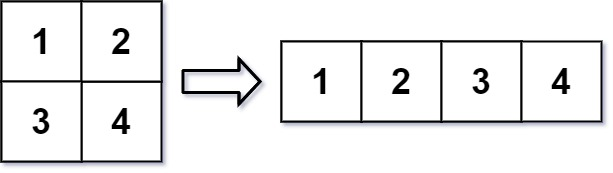
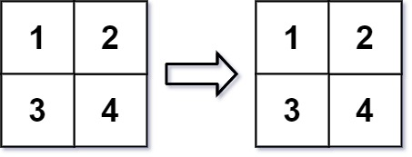

# 문제 설명
MATLAB에는 'm x n' 행렬을 원래 데이터를 유지하는 다른 크기의 'r x c' 행렬로 바꿀 수 있는 'reshape'라는 편리한 기능이 있다.
원하는 재구성된 행렬의 행과 열을 나타내는 'm x n' 행렬 'mat'와 두 정수 'r' 및 'c'가 제공됩니다.
재구성된 행렬은 원래 행렬의 모든 요소를 원래와 동일한 행 이동 순서로 채워야 합니다.
지정된 매개 변수를 사용한 'reshape' 작업이 가능하면 새 재구성된 행렬을 출력하고, 그렇지 않으면 원래 행렬을 출력합니다.

요약: m*n 행렬을 r*c 행렬로 바꿔라 결과는 [r,c]로 반환

---

# 예시
Example 1:



Input: mat = [[1,2],[3,4]], r = 1, c = 4
Output: [[1,2,3,4]]

Example 2:



Input: mat = [[1,2],[3,4]], r = 2, c = 4
Output: [[1,2],[3,4]]

---

# 아이디어 / 설계
나누기와 나머지를 사용해서 행렬의 총 길이인 m * n 만큼 순회한다.

1. r * c 가 원래의 행렬 m * n 보다 크다면, 새로운 행렬을 만들 수 없기 때문에 원래의 행렬을 반환
2. 새로 만들어질 행렬 r * c 만큼 반복한다
3. 결과값 행과 열에 원래의 행렬을 나누기와 나머지를 활용해 저장한다.

예시
mat = [[1,2],[3,4]]
r = 1, c = 4

result[0][0] = mat[0][0] = 1
result[0][1] = mat[0][1] = 2
result[1][0] = mat[0][2] = 3
result[1][1] = mat[0][3] = 4

---

# 문제 풀이
```java
class Solution {
    public int[][] matrixReshape(int[][] mat, int r, int c) {

        int m = mat.length;
        int n = mat[0].length;
        int[][] result = new int[r][c];

        if (m * n != r * c) {
            return mat;
        }

        for (int i = 0; i < r * c; i++) {
            result[i / c][i % c] = mat[i / n][i % n];
        }

        return result;

    }
}
```