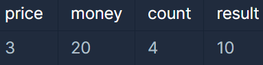

>

### 문제 설명

새로 생긴 놀이기구는 인기가 매우 많아 줄이 끊이질 않습니다. 
이 놀이기구의 원래 이용료는 price원 인데, 놀이기구를 N 번 째 이용한다면 원래 이용료의 N배를 받기로 하였습니다. 

즉, 처음 이용료가 100이었다면 2번째에는 200, 3번째에는 300으로 요금이 인상됩니다.
놀이기구를 count번 타게 되면 현재 자신이 가지고 있는 금액에서 얼마가 모자라는지를 return 하도록 solution 함수를 완성하세요.

단, 금액이 부족하지 않으면 0을 return 하세요.
---

### 제한사항

- 놀이기구의 이용료 price : 1 ≤ price ≤ 2,500, price는 자연수
- 처음 가지고 있던 금액 money : 1 ≤ money ≤ 1,000,000,000, money는 자연수
- 놀이기구의 이용 횟수 count : 1 ≤ count ≤ 2,500, count는 자연수 
---

### 입출력 예시


---

### 설계 / 아이디어

1. 1부터 count까지 반복해서 price에 i를 곱한다
2. 총합은 money보다 크기 때문에 총합에서 money를 뺀다

**주의사항**
놀이 기구 이용료는 최대 2500원
이용 횟수 최대 2500번
2500원을 2500번 타면은 비용은 int 범위를 넘게된다.

따라서 answer과 total은 long을 사용해야 된다.
---

### 문제 풀이

```java
class Solution {
    public long solution(int price, int money, int count) {
        long answer = 0;
        long total = 0;

        for (int i = 1; i <= count; i++) {  // 이용 횟수
            total += price * i;     // 이용료 총합
        }

        answer = (total - money > 0) ? total - money : 0;

        return answer;
    }
}
```