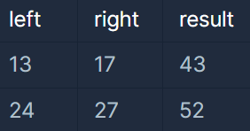
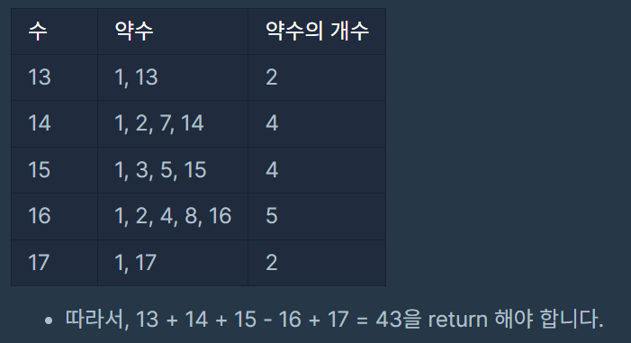

> 두 수 사이의 약수의 합을 구하라

### 문제 설명

두 정수 left와 right가 매개변수로 주어집니다. 
left부터 right까지의 모든 수들 중에서, 
약수의 개수가 짝수인 수는 더하고, 약수의 개수가 홀수인 수는 뺀 수를 return 하도록 solution 함수를 완성해주세요.
---

### 제한사항

- 1 ≤ left ≤ right ≤ 1,000
---

### 입출력 예시



---

### 설계 / 아이디어

1. 첫번째 반복문은 left ~ right까지 반복
2. 두번째 반복문에서 약수를 찾아 count에 저장
3. 저장된 count가 짝수인지 홀수인지 찾고, 더하거나 뻄
---

### 문제 풀이

```java
class Solution {
    public int solution(int left, int right) {
        int answer = 0;
        int count;

        for (int i = left; i <= right; i++) {
            // left부터 right까지 반복해야 되기 때문에 count 초기화
            count = 0;
            // 약수를 찾는 반복문
            for (int j = 1; j <= i; j++) {
                if (i % j == 0) {
                    count++;
                }
            }
            // 약수의 개수가 짝수인 경우 answer에 더하고 아니면 뺌
            answer = (count % 2 == 0) ?  answer + i : answer - i;
//            if (count % 2 == 0) {
//                answer += i;
//            } else answer -= i;
        }
        return answer;
    }
}
```