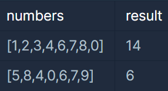

> numbers에서 빠진 숫자를 찾아라

### 문제 설명

0부터 9까지의 숫자 중 일부가 들어있는 정수 배열 numbers가 매개변수로 주어집니다. 
numbers에서 찾을 수 없는 0부터 9까지의 숫자를 모두 찾아 더한 수를 return 하도록 solution 함수를 완성해주세요.
---

### 제한사항

- 1 ≤ numbers의 길이 ≤ 9
 - 0 ≤ numbers의 모든 원소 ≤ 9
 - numbers의 모든 원소는 서로 다릅니다.
---

### 입출력 예시


---

### 설계 / 아이디어

1. 0부터 9까지의 합 45인 answer 선언
2. for문으로 answer에서 numbers 값을 뺌
---

### 문제 풀이

```java
class Solution {
    public int solution(int[] numbers) {
        int answer = 45;

        for (int num : numbers) {
            answer -= num;
        }
        return answer;
    }
}
```