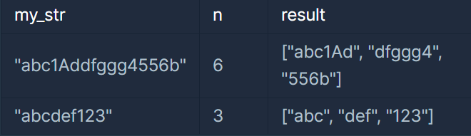

> 문자열을 잘라라

### 문제 설명

문자열 my_str과 n이 매개변수로 주어질 때, my_str을 길이 n씩 잘라서 저장한 배열을 return하도록 solution 함수를 완성해주세요.
---

### 제한사항

- 1 ≤ my_str의 길이 ≤ 100
- 1 ≤ n ≤ my_str의 길이
- my_str은 알파벳 소문자, 대문자, 숫자로 이루어져 있습니다.
---

### 입출력 예시


---

### 문제 풀이

```java
import java.util.*;

class Solution {
    public String[] solution(String my_str, int n) {
        // 문자열을 n으로 나눈 수가 홀수라면 길이가 늘어나기 때문에 1을 추가한다
        int len = (my_str.length() % n == 0) ? my_str.length() / n : (my_str.length() / n) + 1;

        String[] answer = new String[len];

        int idx = 0;
        for(int i = 0; i < my_str.length(); i += n) {
            answer[idx++] = my_str.substring(i, Math.min(i + n, my_str.length()));
        }
        return answer;
    }
}
```