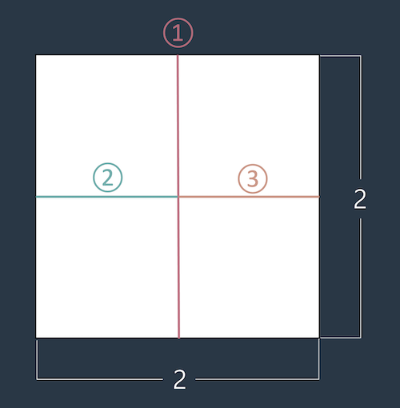
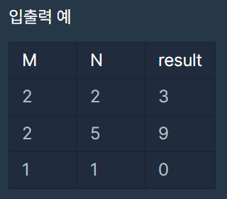

> 가위질을 최소한으로 하라!

### 문제 설명
머쓱이는 큰 종이를 1 x 1 크기로 자르려고 합니다. 예를 들어 2 x 2 크기의 종이를 1 x 1 크기로 자르려면 최소 가위질 세 번이 필요합니다.


정수 M, N이 매개변수로 주어질 때, M x N 크기의 종이를 최소로 가위질 해야하는 횟수를 return 하도록 solution 함수를 완성해보세요.

---

### 제한사항
0 < M, N < 100
종이를 겹쳐서 자를 수 없습니다.

---

### 입출력 예 설명


---

### 설계 / 아이디어
1. 입출력 예시를 보면, `result = M * N - 1` 이다

---

### 문제풀이

```java
class Solution {
    public int solution(int M, int N) {

        int answer =  M * N - 1;

        return answer;
    }
}
```

