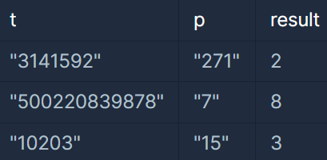

> 문자열 t를 문자열 p의 길이에 맞게 자르고 p보다 작거나 같은 수를 구하시오

### 문제 설명

숫자로 이루어진 문자열 t와 p가 주어질 때, t에서 p와 길이가 같은 부분문자열 중에서, 이 부분문자열이 나타내는 수가 p가 나타내는 수보다 작거나 같은 것이 나오는 횟수를 return하는 함수 solution을 완성하세요.

예를 들어, t="3141592"이고 p="271" 인 경우, t의 길이가 3인 부분 문자열은 314, 141, 415, 159, 592입니다. 
이 문자열이 나타내는 수 중 271보다 작거나 같은 수는 141, 159 2개 입니다.
---

### 제한사항

- 1 ≤ p의 길이 ≤ 18
- p의 길이 ≤ t의 길이 ≤ 10,000 
- t와 p는 숫자로만 이루어진 문자열이며, 0으로 시작하지 않습니다.
---

### 입출력 예 설명

 
---

### 설계 / 아이디어

1. 문자열 t와 p를 long 타입으로 변환
2. diff에 t를 p의 길이 만큼 자른 값을 저장
2. p보다 작거나 같으면 count 저장
---

### 문제 풀이

```java
import java.util.*;

class Solution {
    public int solution(String t, String p) {
        int result = 0;
        int length = p.length();
        long num = Long.parseLong(p);

        for (int i = 0; i <= t.length() - length; i++) {
            long diff = Long.parseLong(t.substring(i, i + length));
            if (diff <= num) {
                result++;
            }
        }
        return result;
    }
}
```